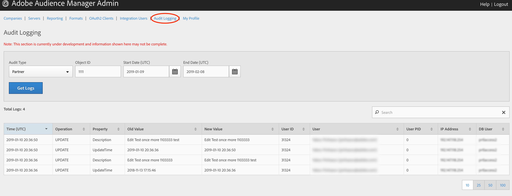

# Registro de auditoría {#audit-logging}

Utilice [!UICONTROL  Audit Logging] como primer lugar para depurar los problemas de los clientes.

> [!NOTE]
>
>[!UICONTROL Audit Logging] está actualmente en desarrollo y sujeto a cambios. Registre los problemas que encuentre en [!DNL JIRA] ([!DNL UI] equipo)

En **el selector** desplegable Tipo de auditoría, elija entre:

* [!UICONTROL Partner]
* [!UICONTROL User]
* [!UICONTROL Group]
* [!UICONTROL Datasource Summary]
* [!UICONTROL General Datasource]
* [!UICONTROL Merge Rule Datasource]
* [!UICONTROL Data Feed]
* [!UICONTROL Data Feed Subscription]
* [!UICONTROL Trait Summary]
* [!UICONTROL Trait Rule]
* [!UICONTROL Segment Summary]
* [!UICONTROL Destination Summary]
* [!UICONTROL Server to Server Destination]
* [!UICONTROL Derived Signal]
* [!UICONTROL Model]
* [!UICONTROL Segment Test Group]

El ID **de objeto** es el ID del elemento que está investigando. Consulte la tabla siguiente para ver el ID que corresponde al ID de objeto en cada caso:

| Tipo de auditoría | ID del objeto |
---------|----------|
| [!UICONTROL Partner] | ID del socio - PID |
| [!UICONTROL User] | ID de usuario |
| [!UICONTROL Group] | B3 |
| [!UICONTROL Datasource Summary] | ID de fuente de datos |
| [!UICONTROL General Datasource] | ID de fuente de datos |
| [!UICONTROL Merge Rule Datasource] | ID de fuente de datos |
| [!UICONTROL Data Feed] | ID de fuente de datos |
| [!UICONTROL Data Feed Subscription] | ID de fuente de datos |
| [!UICONTROL Trait Summary] | SID (trait) |
| [!UICONTROL Trait Rule] | SID (trait) |
| [!UICONTROL Segment Summary] |  |
| [!UICONTROL Destination Summary] |  |
| [!UICONTROL Server-to-Server Destination] | N.D. |
| [!UICONTROL Derived Signal] | N.D. |
| [!UICONTROL Model] | N.D. |
| [!UICONTROL Segment Test Group] | N.D. |

Utilice [!UICONTROL Start Date] ([!DNL UTC]) y [!UICONTROL End Date] ([!DNL UTC]) para reducir el intervalo de tiempo de los registros.