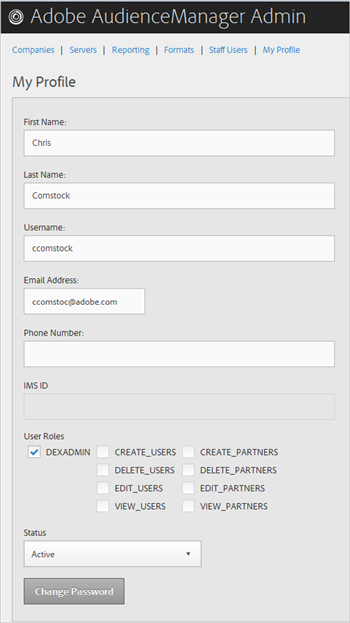
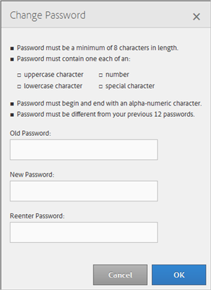

# Mi Perfil {#my-profile}

Edite los detalles del perfil de la herramienta de administración de Audience Manager o cambie su contraseña.

<!-- c_my_profile.xml -->

## Editar Perfil {#edit-profile}

Vista y edite el perfil de la herramienta de administración de Audience Manager, incluidos el nombre y los apellidos, el nombre de usuario, la dirección de correo electrónico, el número de teléfono, [!UICONTROL IMS ID], las funciones de usuario y el estado.

<!-- t_edit_profile.xml -->

1. Haga clic **[!UICONTROL My Profile]**.

   

2. Rellene los campos:
   * **[!UICONTROL First Name]:** (Obligatorio) Especifique su nombre.
   * **[!UICONTROL Last Name]:** (Obligatorio) Especifique su apellido.
   * **[!UICONTROL Username]:** (Requerido) Especifique su primer nombre de usuario.
   * **[!UICONTROL Email Address]:** (Obligatorio) Especifique su dirección de correo electrónico.
   * **[!UICONTROL Phone Number]:** Especifique su número de teléfono.
   * **[!UICONTROL IMS ID]:** Especifique su ID de servicio de mensajería de Internet.
   * **[!UICONTROL User Roles]:** Seleccione las funciones de usuario que desee:
      * **[!UICONTROL DEXADMIN]:** Proporciona acceso de administrador para realizar tareas en la herramienta de administración de Audience Manager. Si no selecciona esta opción, puede elegir funciones individuales. Estas funciones permiten a los usuarios realizar tareas mediante llamadas [!DNL API], pero no en la herramienta de administración.
      * **[!UICONTROL CREATE_USERS]:** Permite a los usuarios crear nuevos usuarios mediante una  [!DNL API] llamada.
      * **[!UICONTROL DELETE_USERS]:** Permite a los usuarios eliminar usuarios existentes mediante una  [!DNL API] llamada.
      * **[!UICONTROL EDIT_USERS]:** Permite a los usuarios editar usuarios existentes mediante una  [!DNL API] llamada.
      * **[!UICONTROL VIEW_USERS]:** Permite a los usuarios realizar vistas a otros usuarios en la configuración del Audience Manager mediante una  [!DNL API] llamada.
      * **[!UICONTROL CREATE_PARTNERS]:** Permite a los usuarios crear socios Audience Manager mediante una  [!DNL API] llamada.
      * **[!UICONTROL DELETE_PARTNERS]:** Permite que los usuarios eliminen socios Audience Manager mediante una  [!DNL API] llamada.
      * **[!UICONTROL EDIT_PARTNERS]:** Permite a los usuarios editar socios Audience Manager mediante una  [!DNL API] llamada.
      * **[!UICONTROL VIEW_PARNTERS]:** Permite a los usuarios vista a socios Audience Manager mediante una  [!DNL API] llamada.
   * **[!UICONTROL Status]:** Seleccione el estado que desee:
      * **[!UICONTROL Active]:** Especifica que este usuario está en un usuario de Audience Manager activo.
      * **[!UICONTROL Deactivated]:** Especifica que este usuario es un usuario desactivado en Administración de Audiencias.
      * **[!UICONTROL Expired]:** Especifica que la cuenta de este usuario en Audience Manager ha caducado.
      * **[!UICONTROL Locked Out]:** Especifica que la cuenta de este usuario en el Audience Manager está bloqueada.
3. Haga clic **[!UICONTROL Submit]**.

## Cambiar contraseña {#change-password}

Cambie la contraseña de la herramienta de administración de Audience Manager.

<!-- t_change_password.xml -->

1. Haga clic **[!UICONTROL My Profile]**.
1. Haga clic **[!UICONTROL Change Password]**.

   

   La contraseña del Audience Manager debe ser:

   * Al menos ocho caracteres de longitud;
   * Contener al menos un carácter en mayúsculas;
   * Contener al menos un carácter en minúsculas;
   * Contener al menos un número;
   * Contener al menos un carácter especial;
   * Comenzar y finalizar con un carácter alfanumérico;
   * Comience y termine con un carácter alfanumérico.

1. Especifique la contraseña antigua.
1. Especifique la nueva contraseña y confirme la nueva.
1. Haga clic **[!UICONTROL OK]**.