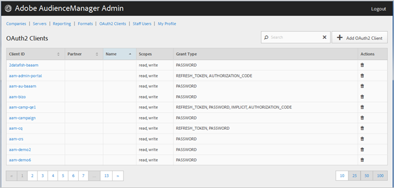

# Clientes de OAuth2 {#oauth-clients}

Utilice el [!UICONTROL OAuth2 Clients] para ver una lista de [!UICONTROL OAuth2] clientes en su [!DNL Audience Manager] configuración. Puede editar o eliminar clientes existentes o crear nuevos clientes, siempre que tenga asignados los roles de usuario adecuados.

## Información general {#overview}

<!-- c_oauth.xml -->

>[!NOTE]
>
>Asegúrese de que el cliente lea el [OAuth2](https://experienceleague.adobe.com/docs/audience-manager/user-guide/api-and-sdk-code/rest-apis/aam-api-getting-started.html#oauth) en la Guía del usuario de Audience Manager.

[!DNL OAuth2] es un estándar abierto para la autorización de proporcionar acceso delegado protegido a [!DNL Audience Manager] recursos en nombre de un propietario de recursos.

Puede ordenar cada columna en orden ascendente o descendente haciendo clic en el encabezado de la columna deseada.

Utilice el [!UICONTROL Search] o los controles de paginación situados en la parte inferior de la lista para buscar el cliente deseado.

## Crear o editar un cliente de OAuth2 {#create-edit-client}

<!-- t_create_edit_auth.xml -->

Utilice el [!UICONTROL OAuth2 Clients] página en el Audience Manager [!UICONTROL Admin] herramienta para crear una nueva [!UICONTROL Oauth2] o para editar un cliente existente.

1. Para crear un nuevo [!UICONTROL OAuth2] cliente, haga clic en **[!UICONTROL OAuth2 Clients]** > **[!UICONTROL Add OAuth2 Client]**. Para editar una existente [!UICONTROL OAuth2] cliente, haga clic en el cliente deseado en la **[!UICONTROL Client ID]** columna.
1. Especifique el nombre que desee para esto [!UICONTROL OAuth2] cliente. Tenga en cuenta que este es un nombre solo para el registro.
1. Especifique el [!UICONTROL OAuth2] la dirección de correo electrónico del cliente. Hay un límite de una dirección de correo electrónico.
1. Desde el **[!UICONTROL Partner]** , seleccione el socio que desee.
1. En el **[!UICONTROL Client ID]** , especifique el ID que desee. Este es el valor que se usa al enviar [!DNL API] solicitudes. El prefijo se rellena automáticamente cuando empieza a escribir después de haber elegido una [!UICONTROL Partner] en la lista desplegable del paso anterior. El formato correcto es &lt; *`partner subdomain`*> - &lt; *`Audience Manager username`*>.
1. Seleccione o anule la selección del **[!UICONTROL Restrict to Partner Users]** casilla de verificación, como desee. Si esta casilla de verificación está activada, el usuario debe ser un [!DNL Audience Manager] usuario de la lista del socio seleccionado. Como práctica recomendada, le recomendamos que seleccione esta opción.
1. En el **[!UICONTROL Scope]** , seleccione o anule la selección de **[!UICONTROL Read]** y **[!UICONTROL Write]** casillas de verificación, si lo desea.
1. En el **[!UICONTROL Grant Type]** , seleccione el medio de autorización que desee. Le recomendamos que utilice la configuración predeterminada de [!UICONTROL Password] y [!UICONTROL Refresh-token] opciones.

   * **[!UICONTROL Implicit]**: Si selecciona esta opción, la variable [!UICONTROL Redirect URI] La casilla está activada. Al usuario se le proporciona un token de acceso automático después de autenticarse y se le envía inmediatamente a la redirección [!DNL URI].
   * **[!UICONTROL Authorization Code]**: Si selecciona esta opción, la variable [!UICONTROL Redirect URI] La casilla está activada. El usuario se devuelve al cliente después de autenticarse y, a continuación, se envía a la redirección [!DNL URI].
   * **[!UICONTROL Password]**: el usuario se autentica con una contraseña introducida por el usuario en lugar de un intento de validación automático a través de un servidor de autorización.
   * **[!UICONTROL Refresh_token]**: se utiliza para actualizar un token de acceso caducado durante un período de tiempo prolongado.

1. En el **[!UICONTROL Redirect URI]** , especifique el deseado [!DNL URI]. Esta opción solo está habilitada si selecciona la variable **[!UICONTROL Implicit]** y **[!UICONTROL Authorization_code]** tipos de concesión. El **[!UICONTROL Redirect URI]** permite especificar un valor aceptable separado por comas [!DNL URI] valores. Este es el [!DNL URI] se redirige al usuario de un cliente a después de aprobar el cliente para [!DNL API] acceso.
1. Especifique el tiempo de caducidad deseado (en segundos) para el acceso y la caducidad del token de actualización.

   * **[!UICONTROL Access Token Expiration Time]**: el número de segundos que un token de acceso es válido después de emitirse. Puede ser nulo para utilizar la plataforma predeterminada (12 horas). También puede ser -1 para indicar que el token de acceso no caduca.
   * **[!UICONTROL Refresh Token Expiration Time]**: el número de segundos que un token de actualización es válido después de emitirse. Puede ser nulo para utilizar la plataforma predeterminada (30 días).

1. Haga clic **[!UICONTROL Save]**.

Para eliminar una [!UICONTROL OAuth2] cliente, haga clic en **[!UICONTROL OAuth2 Clients]**, luego haga clic en   en el **[!UICONTROL Actions]** para el cliente deseado.

>[!MORELIKETHIS]
>
>* [Requisitos y recomendaciones de API](../admin-oauth2/aam-admin-api-requirements.md)

