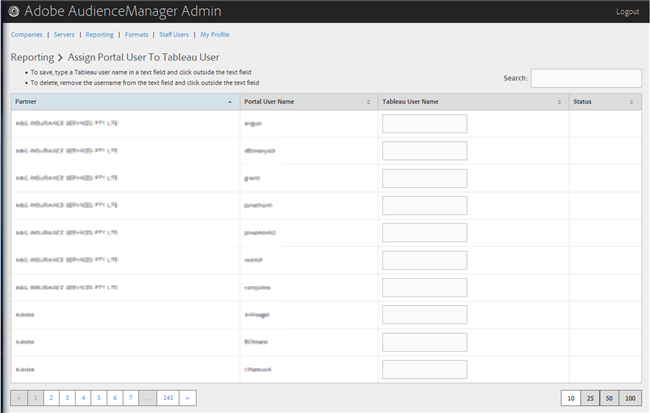

# Asignar un usuario de portal a un usuario Tableau {#assign-a-portal-user-to-tableau-user}

<!-- t_tabeau.xml -->

Utilice [!UICONTROL Reporting] la página para convertir a un usuario del portal en [!DNL Tableau] usuario. Esto permite a los usuarios ver [!DNL Tableau] informes en Audience Manager.

1. Click **[!UICONTROL Reporting]** &gt; **[!UICONTROL Assign Portal User to Tableau User]**.

   

1. Para asignar un usuario, en la fila de socio deseada, escriba un [!DNL Tableau] nombre de usuario en el campo de texto y luego haga clic fuera del campo de texto.

Para eliminar una asignación de usuario, en la fila de socio deseada, elimine el nombre de usuario del campo de texto y, a continuación, haga clic fuera del campo de texto.
