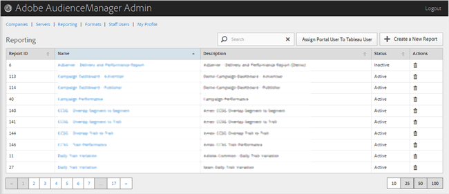

# Informes {#reporting}

Administre los informes de Audience Manager creando nuevos informes o editando o eliminando los informes existentes. También puede asignar un usuario de portal como [!DNL Tableau] usuario.

<!-- c_reporting.xml -->

Puede ordenar cada columna en orden ascendente o descendente haciendo clic en el encabezado de la columna deseada.

Use el [!UICONTROL Search] cuadro o los controles de paginación en la parte inferior de la lista para encontrar el informe deseado.
