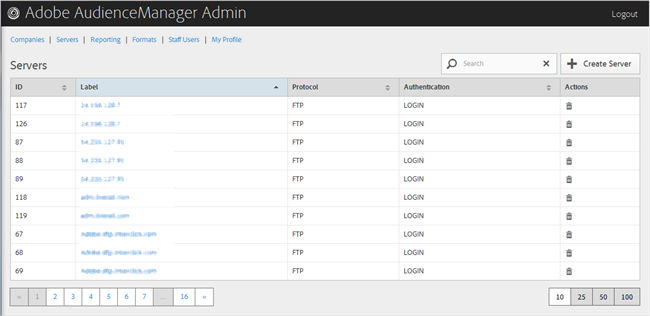

# Eliminar un servidor {#delete-a-server}

Utilice [!UICONTROL Servers] la página de la herramienta de administración de Audience Manager para eliminar un servidor existente.

<!-- t_delete_server.xml -->

>[!NOTE]
>
>Debe tener [!UICONTROL DEXADMIN] la función para eliminar los servidores existentes.

1. Para eliminar un servidor existente, haga clic **[!UICONTROL Servers]** en.

   

1. Haga clic en  la **[!UICONTROL Actions]** columna del servidor que desee.
1. Click **[!UICONTROL OK]** to confirm the deletion.
