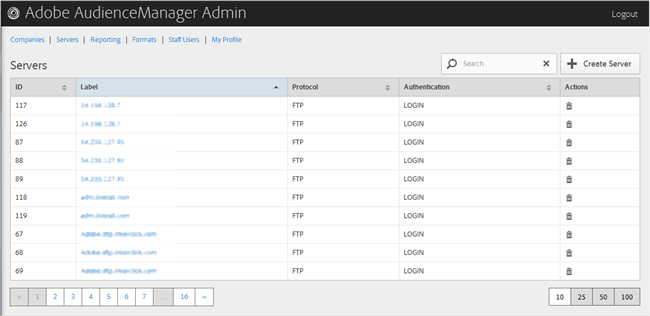

# Información general sobre servidores {#servers-overview}

Utilice la página [!UICONTROL Servers] para vista de una lista de servidores en la configuración del Audience Manager. Puede editar o eliminar servidores existentes o crear nuevos servidores, siempre que tenga asignadas las funciones de usuario correspondientes.

<!-- c_servers.xml -->

Puede ordenar cada columna en orden ascendente o descendente haciendo clic en el encabezado de la columna deseada. Use el cuadro [!UICONTROL Search] o los controles de paginación en la parte inferior de la lista para encontrar el servidor deseado.