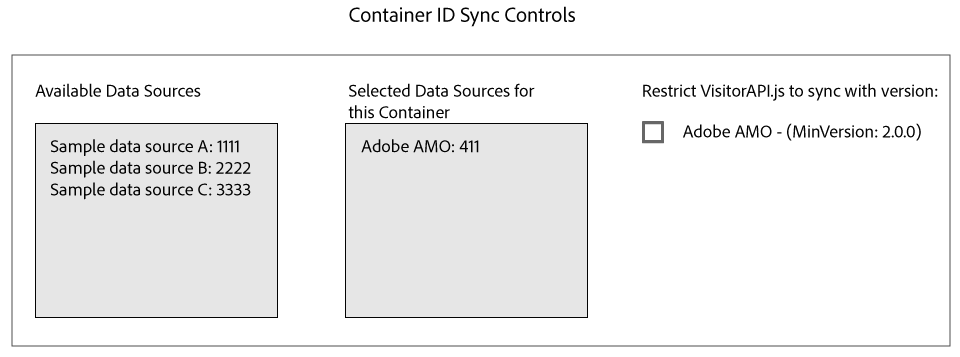

# Sincronización de ID con Media Optimizer {#id-syncing-with-media-optimizer}

De forma predeterminada, todas las empresas sincronizan datos con [!DNL Adobe Media Optimizer] ([!DNL AMO]). En el [!UICONTROL Admin UI], cada contenedor de empresa tiene un origen de datos que administra este proceso. Esta fuente de datos es [!UICONTROL Adobe AMO] ([!UICONTROL ID] 411). Haga clic en una fila de contenedor (debajo de la [!UICONTROL Containers] ficha) para que una empresa seleccionada desactive esta sincronización predeterminada o para agregar y eliminar otras fuentes de datos al proceso de [!DNL AMO] sincronización.

## Estado de sincronización de ID {#id-sync-status}

En la tabla siguiente se describe el estado de sincronización de un origen de datos.

| Estado | Descripción |
|------ | -------- |
| Off | Quitar todas las fuentes de datos de [!UICONTROL Selected Data Sources] este contenedor para deshabilitar las sincronizaciones de ID con [!DNL AMO] |
| Activado (independientemente de la versión del servicio de ID) | Una fuente de datos se sincroniza con [!DNL AMO] independientemente de la versión del servicio de ID cuando: <ul><li>El origen de datos aparece en la [!UICONTROL Selected Data Sources] lista.</li><li>La [!DNL AMO] casilla de verificación no *está* seleccionada.</li></ul> |
| Activado (independientemente de la versión del servicio de ID) | Una fuente de datos se sincronizará con [!DNL AMO] la versión 2.0 (o superior) del servicio de ID cuando: <ul><li>El origen de datos aparece en la [!UICONTROL Selected Data Sources] lista.</li><li>La [!DNL AMO] casilla de verificación *está* seleccionada.</li></ul> |

>[!MORE_LIKE_THIS]
>
>* [Administrar contenedores](../companies/admin-manage-containers.md#task_61DB5CEECC5049DD8D059C642AC3F967)

