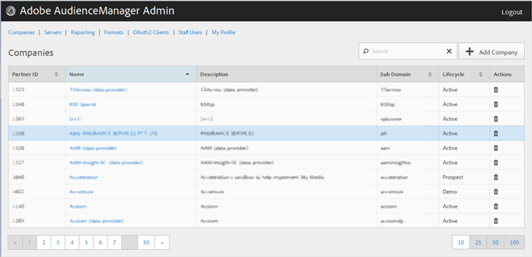

# Empresas {#companies}

Utilice la [!UICONTROL Companies] página para ver una lista de empresas de la configuración de Audience Manager. Puede editar o eliminar empresas existentes o crear empresas nuevas, siempre que tenga asignadas las funciones de usuario correspondientes.

Puede ordenar cada columna en orden ascendente o descendente haciendo clic en el encabezado de la columna deseada.

Use el [!UICONTROL Search] cuadro o los controles de paginación en la parte inferior de la lista para encontrar la empresa deseada.
