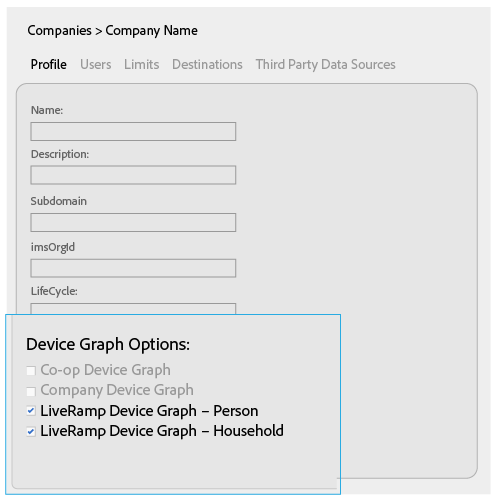
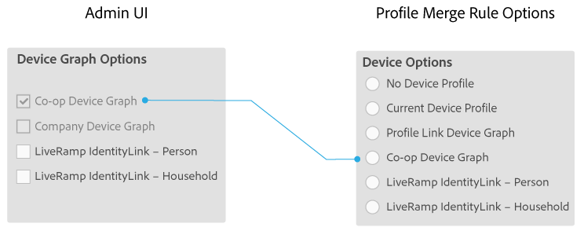
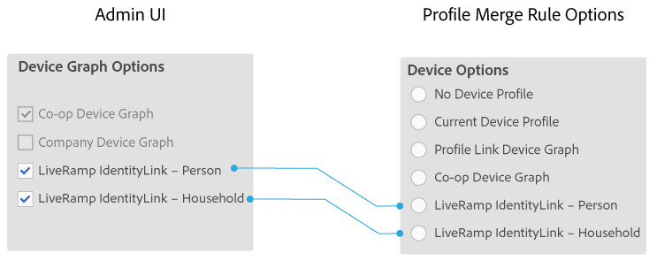

# Opciones de gráfico de dispositivos para empresas {#device-graph-options-for-companies}

Están [!UICONTROL Device Graph Options] disponibles para las empresas que participan en [!DNL Adobe Experience Cloud Device Co-op]la. Si un cliente tiene también una relación contractual con un proveedor de gráficos de dispositivos de terceros que está integrado con Audience Manager, esta sección mostrará las opciones para el gráfico de dispositivos. Estas opciones se encuentran en [!UICONTROL Companies] &gt; nombre de empresa &gt; [!UICONTROL Profile] &gt; [!UICONTROL Device Graph Options].

Esta ilustración utiliza nombres genéricos para las opciones de gráficos de dispositivos de terceros. En la producción, estos nombres proceden del proveedor de gráficos de dispositivos y pueden variar de los que se muestran aquí. Por ejemplo, las [!DNL LiveRamp] opciones normalmente (pero no siempre):

* Empiece por "[!DNL LiveRamp]"
* Contener un nombre central que varíe
* Finalizar con "[!UICONTROL - Household]o"[!UICONTROL -Person]

## Opciones de Device Graph definidas {#device-graph-options-defined}

Las opciones de gráfico de dispositivos que seleccione aquí exponen u ocultan [!UICONTROL Device Options] las opciones disponibles para un [!DNL Audience Manager] cliente cuando crean [!UICONTROL Profile Merge Rule]una.

### Device Graph Co-op {#co-op-graph}

Los clientes que participan en [Adobe Experience Cloud Device Co-op](https://marketing.adobe.com/resources/help/en_US/mcdc/) utilizan estas opciones para crear datos [!UICONTROL Profile Merge Rule][determinísticos y probabilísticos](https://marketing.adobe.com/resources/help/en_US/mcdc/mcdc-links.html). La [!DNL Corporate Provisioning Team] opción activa y desactiva esta opción mediante [!DNL API] una llamada back-end. No puede comprobar ni borrar estos cuadros en [!DNL Admin UI]la. Además, **[!UICONTROL Co-op Device Graph]** las opciones y **[!UICONTROL Company Device Graph]** las opciones se excluyen mutuamente. Los clientes pueden solicitar que activemos una o otra, pero no ambas. Cuando se selecciona, se expone el **[!UICONTROL Co-op Device Graph]** control en [!UICONTROL Device Options] la configuración de un [!UICONTROL Profile Merge Rule].

### Device Device Graph {#company-graph}

Esta opción es para [!DNL Analytics] clientes que usan [!UICONTROL People] la métrica en su grupo [!DNL Analytics] de informes. La [!DNL Corporate Provisioning Team] opción activa y desactiva esta opción mediante [!DNL API] una llamada back-end. No puede comprobar ni borrar estos cuadros en [!DNL Admin UI]la. Además, **[!UICONTROL Company Device Graph]** las opciones y **[!UICONTROL Co-op Device Graph]** las opciones se excluyen mutuamente. Los clientes pueden solicitar que activemos una o otra, pero no ambas. Cuando se selecciona:

* Este gráfico de dispositivos utiliza datos determinísticos que pertenecen a la empresa que está configurando (sin datos probabilísticos).
* [!DNL Audience Manager] crea automáticamente un [!UICONTROL Data Source] nombre de `*`socio denominado`*-Company Device Graph-Person`. En la [!UICONTROL Data Source] página de detalles [!DNL Audience Manager] , los clientes pueden cambiar el nombre del socio, la descripción y aplicar [controles de exportación de datos](https://marketing.adobe.com/resources/help/en_US/aam/c_dec.html) a esta fuente de datos.
* [!DNL Audience Manager] Los clientes *no* ven una nueva configuración en la [!UICONTROL Device Options] sección para un [!UICONTROL Profile Merge Rule].

### Liveramp Device Graph (Persona o Hogar) {#liveramp-device-graph}

Estas casillas de verificación están activadas en [!DNL Admin UI] el momento en que un socio crea [!UICONTROL Data Source] y selecciona **[!UICONTROL Use as an Authenticated Profile]** y/o **[!UICONTROL Use as a Device Graph]**. Los nombres de estas configuraciones son determinados por el proveedor de gráficos de dispositivos de terceros (por ejemplo, [!DNL LiveRamp]etc [!DNL TapAd].). Cuando se selecciona, significa que la empresa que está configurando va a utilizar los datos proporcionados por estos gráficos de dispositivos.

>[!MORE_ LIKE_ THIS]
>
>* [Opciones de regla de combinación de perfiles definidas](https://marketing.adobe.com/resources/help/en_US/aam/merge-rule-definitions.html)
>* [Configuración de la fuente de datos y opciones de menú](https://marketing.adobe.com/resources/help/en_US/aam/datasource-settings-definitions.html)

