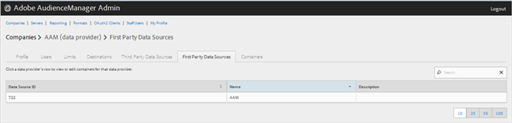
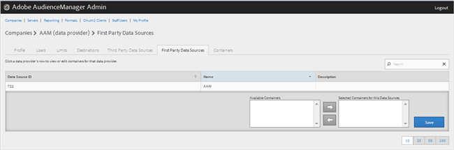

# Administrar proveedores de datos personales {#manage-first-party-data-providers}

Vista o edición de contenedores y asignaciones para proveedores de datos de origen.

<!-- t_first_party_providers.xml -->

1. Haga clic en **[!UICONTROL Companies]**, luego localice y haga clic en la compañía deseada para mostrar su [!UICONTROL Profile] página. Use el [!UICONTROL Search] cuadro o los controles de paginación en la parte inferior de la lista para encontrar la compañía deseada. Puede ordenar cada columna en orden ascendente o descendente haciendo clic en el encabezado de la columna deseada.

1. Click the **[!UICONTROL First Party Data Providers]** tab.

   

1. Haga clic en la fila de un proveedor de datos para realizar la vista o editar contenedores y asignaciones para ese proveedor de datos.

   

1. Mueva contenedores de las **[!UICONTROL Available Containers]** listas y **[!UICONTROL Selected Containers for This Data Provider]** seleccionando los contenedores deseados y haciendo clic en las flechas derecha o izquierda según sea necesario.
1. Haga clic **[!UICONTROL Save]** si ha realizado cambios.