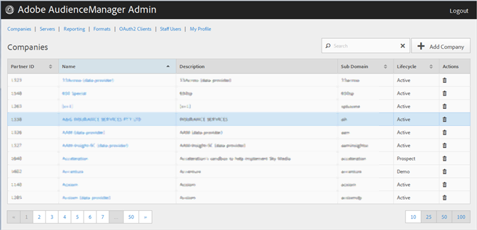

# Crear un perfil de compañía {#create-a-company-profile}

Utilice el [!UICONTROL Companies] en la herramienta de administración de Audience Manager para crear una nueva empresa.

<!-- t_create_company.xml -->

>[!NOTE]
>
>Debe tener el **[!UICONTROL DEXADMIN]** función para crear nuevas empresas.

1. Haga clic **[!UICONTROL Companies]** > **[!UICONTROL Add Company]**.
1. Rellene los campos:

   * **[!UICONTROL Name]**: (Obligatorio) Especifique el nombre de la empresa.
   * **[!UICONTROL Description]**: (Obligatorio) Proporcione información descriptiva sobre la empresa, como el sector o su nombre completo.
   * **[!UICONTROL Subdomain]**: (obligatorio) especifique el subdominio de la empresa. El texto que introduzca será el que se mostrará como subdominio de la llamada de evento. Esto no se puede cambiar. Debe ser una cadena de [!DNL URL]-caracteres válidos.

      Por ejemplo, si el nombre de su empresa es [!DNL AcmeCorp], el subdominio sería [!DNL acmecorp].

      El Audience Manager utiliza el subdominio para [!UICONTROL Data Collection Server] (DCS). En el ejemplo anterior, si la compañía está llena [!DNL URL] in [!UICONTROL DCS] sería [!DNL acmecorp.demdex.net].

   * **[!UICONTROL Lifecyle]**: especifique el escenario deseado para la empresa:
      * **[!UICONTROL Active]**: especifique que la empresa será un cliente Audience Manager activo. Un [!UICONTROL Active] cuenta significa un cliente que paga, no solo por asesoría, sino por el SKU del Audience Manager.
      * **[!UICONTROL Demo]**: especifique que la empresa solo se utilizará con fines de demostración. Los datos de los informes se falsificarán automáticamente.
      * **[!UICONTROL Prospect]**: especifique que la empresa es un cliente Audience Manager potencial, como una empresa a la que se le está dando un [!DNL POC] o una configuración de cuenta para una demostración de ventas.
      * **[!UICONTROL Test]**: especifique que la empresa solo se utilizará para pruebas internas.
   * **[!UICONTROL Account Types]**: especifique el conjunto completo de tipos de cuenta para esta compañía. Ningún tipo de cuenta es mutuamente excluyente con ningún otro tipo.
      * **[!UICONTROL Full AAM]**: especifique que la empresa tendrá una cuenta de Adobe Audience Manager completa y los usuarios tendrán acceso de inicio de sesión.
      * **[!UICONTROL MMP]**: especifique que la empresa ha sido habilitada para usar el [!UICONTROL Master Marketing Profile] ([!UICONTROL MMP]) funciones. El [!UICONTROL MMP] permite que las audiencias se compartan entre el Experience Cloud mediante una [!UICONTROL Experience Cloud ID] ([!DNL MCID]) que se asigna a cada visitante y que luego utiliza el Audience Manager. Si selecciona este tipo de cuenta, la variable [!UICONTROL Experience Cloud ID Service] también se selecciona automáticamente.

         Para obtener más información, consulte [Audiencias de Experience Cloud](https://experienceleague.adobe.com/docs/core-services/interface/services/audiences/audience-library.html?lang=en).
   * **[!UICONTROL Data Source]**: especifique que la empresa es un proveedor de datos de terceros dentro de Audience Manager.
   * **[!UICONTROL Targeting Partner]**: especifique que la empresa actúa como una plataforma de segmentación para los clientes de Audience Manager.
   * **[!UICONTROL Visitor ID Service]**: especifique que la empresa ha sido habilitada para usar el [!UICONTROL Experience Cloud Visitor ID Service].

      El [!UICONTROL Experience Cloud Visitor ID Service] proporciona un ID de visitante universal para todas las soluciones de Experience Cloud. Para obtener más información, consulte la [Guía del usuario del servicio de ID de visitante de Experience Cloud](https://experienceleague.adobe.com/docs/id-service/using/intro/overview.html?lang=en).

   * **[!UICONTROL Agency]**: especifique que la empresa tendrá un [!UICONTROL Agency] cuenta.

1. Haga clic **[!UICONTROL Create]**. Siga las instrucciones de [Editar un perfil de compañía](../companies/admin-manage-company-profiles.md#edit-company-profile).

   

## Editar un perfil de compañía {#edit-company-profile}

Edite el perfil de una empresa, incluido su nombre, descripción, subdominio, ciclo de vida y mucho más.

<!-- t_edit_company_profile.xml -->

1. Clic **[!UICONTROL Companies]**, luego busque y haga clic en la empresa deseada para mostrar su [!UICONTROL Profile] página.

   Utilice el [!UICONTROL Search] o los controles de paginación en la parte inferior de la lista para encontrar la empresa deseada. Puede ordenar cada columna en orden ascendente o descendente haciendo clic en el encabezado de la columna deseada.

   

1. Edite los campos como sea necesario:

   * **[!UICONTROL Name]**: edite el nombre de la empresa. Este campo es obligatorio.
   * **[!UICONTROL Description]**: edite la descripción de la empresa. Este campo es obligatorio.
   * **[!UICONTROL Subdomain]**: (obligatorio) especifique el subdominio de la empresa. El texto que introduzca será el que se mostrará como subdominio de la llamada de evento. Esto no se puede cambiar. Debe ser una cadena de [!DNL URL]-caracteres válidos.

      Por ejemplo, si el nombre de su empresa es [!DNL AcmeCorp], el subdominio sería [!DNL acmecorp].

      El Audience Manager utiliza el subdominio para [!UICONTROL Data Collection Server] (DCS). En el ejemplo anterior, si la compañía está llena [!DNL URL] in [!UICONTROL DCS] sería [!DNL acmecorp.demdex.net].

   * **[!UICONTROL imsOrgld]**: ([!UICONTROL Identity Management System Organization ID]) Este ID le permite conectar su empresa con Adobe Experience Cloud.
   * **[!UICONTROL Lifecyle]**: especifique el escenario deseado para la empresa:
      * **[!UICONTROL Active]**: especifique que la empresa será un cliente Audience Manager activo. Una cuenta activa significa un cliente que paga, no solo por asesoría, sino por el SKU del Audience Manager.
      * **[!UICONTROL Demo]**: especifique que la empresa solo se utilizará con fines de demostración. Los datos de los informes se falsificarán automáticamente.
      * **[!UICONTROL Prospect]**: especifique que la empresa es un cliente Audience Manager potencial, como una empresa a la que se le está dando un [!DNL POC] o una configuración de cuenta para una demostración de ventas.
      * **[!UICONTROL Test]**: especifique que la empresa solo se utilizará para pruebas internas.
   * **[!UICONTROL Account Types]**: especifique el conjunto completo de tipos de cuenta para esta compañía. Ningún tipo de cuenta es mutuamente excluyente con ningún otro tipo.
      * **[!UICONTROL Full AAM]**: especifique que la empresa tendrá una cuenta de Adobe Audience Manager completa y los usuarios tendrán acceso de inicio de sesión.
      * **[!UICONTROL MMP]**: especifique que la empresa ha sido habilitada para usar el perfil de marketing principal ([!UICONTROL MMP]) funciones.

         Si selecciona este tipo de cuenta, **[!UICONTROL Visitor ID Service]** también se selecciona automáticamente.
Para obtener más información, consulte [Audiencias de Experience Cloud](https://experienceleague.adobe.com/docs/core-services/interface/services/audiences/audience-library.html?lang=en).
   * **[!UICONTROL Data Source]**: especifique que la empresa es un proveedor de datos de terceros dentro de Audience Manager.
   * **[!UICONTROL Targeting Partner]**: especifique que la empresa actúa como una plataforma de segmentación para los clientes de Audience Manager.
   * **[!UICONTROL Visitor ID Service]**: especifique que la empresa ha sido habilitada para usar el servicio de ID de visitante de Experience Cloud.

      El servicio de identificación de visitantes de Experience Cloud proporciona un ID de visitante universal en las soluciones de Experience Cloud. Para obtener más información, consulte la [Guía del usuario del servicio de ID de Experience Cloud](https://experienceleague.adobe.com/docs/id-service/using/home.html?lang=en).

   * **[!UICONTROL Agency]**: especifique que la empresa tendrá una cuenta de Agencia.
   * **[!UICONTROL Features]**: Seleccione las opciones que desee:
      * **[!UICONTROL Password Expiration]**: establece que todas las contraseñas de usuario de esta compañía caduquen pasados 90 días para aumentar la seguridad del Audience Manager.
      * **[!UICONTROL Reporting]**: habilita los informes de Audience Manager para esta empresa.
      * **[!UICONTROL Role Based Access Controls]**: habilite controles de acceso basados en funciones para esta compañía. Los controles de acceso basados en funciones permiten crear grupos de usuarios con diferentes permisos de acceso. Los usuarios individuales de estos grupos solo pueden acceder a funciones específicas en Audience Manager.

1. Haga clic **[!UICONTROL Submit Updates]**.

## Eliminar un perfil de compañía {#delete-company-profile}

Utilice el [!UICONTROL Companies] página en el Audience Manager [!UICONTROL Admin] para eliminar una empresa existente.

<!-- t_delete_company.xml -->

>[!NOTE]
>
>Debe tener el [!UICONTROL DEXADMIN] para eliminar las empresas existentes.

1. Para eliminar una empresa existente, haga clic en **[!UICONTROL Companies]**.

   

1. Clic   en el **[!UICONTROL Actions]** de la empresa deseada.
1. Clic **[!UICONTROL OK]** para confirmar la eliminación.
