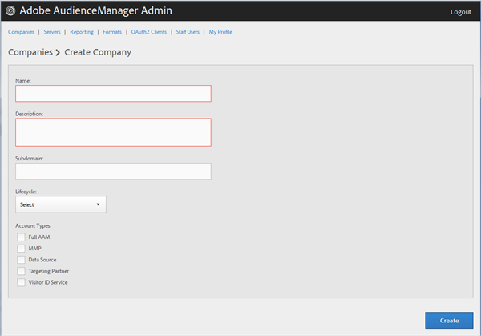

# Crear un perfil de compañía {#create-a-company-profile}

Utilice la página [!UICONTROL Companies] de la herramienta de administración de Audience Manager para crear una nueva compañía.

<!-- t_create_company.xml -->

>[!NOTE]
>
>Debe tener la **[!UICONTROL DEXADMIN]** función de crear nuevas compañías.

1. Haga clic **[!UICONTROL Companies]** > **[!UICONTROL Add Company]**.
1. Rellene los campos:

   * **[!UICONTROL Name]**:: (Requerido) Especifique el nombre de la compañía.
   * **[!UICONTROL Description]**:: (Requerido) Proporcione información descriptiva sobre la compañía, como la industria o su nombre completo.
   * **[!UICONTROL Subdomain]**:: (Requerido) Especifique el subdominio de la compañía. El texto que introduzca es lo que se muestra como subdominio de la llamada de evento. Esto no se puede cambiar. Debe ser una cadena de caracteres [!DNL URL]-válidos.

      Por ejemplo, si su compañía tuviera el nombre [!DNL AcmeCorp], el subdominio sería [!DNL acmecorp].

      Audience Manager utiliza el subdominio para el [!UICONTROL Data Collection Server] (DCS). En el ejemplo anterior, si la compañía está llena [!DNL URL] en [!UICONTROL DCS] sería [!DNL acmecorp.demdex.net].

   * **[!UICONTROL Lifecyle]**:: Especifique la etapa deseada para la compañía:
      * **[!UICONTROL Active]**:: Especifique que la compañía será un cliente Audience Manager activo. Una [!UICONTROL Active] cuenta significa un cliente de pago, no sólo por consultoría, sino también por el SKU del Audience Manager.
      * **[!UICONTROL Demo]**:: Especifique que la compañía será solo para fines de demostración. Los datos de sistema de informes se falsificarán automáticamente.
      * **[!UICONTROL Prospect]**:: Especifique que la compañía es un cliente Audience Manager potencial, como una compañía que se le otorga de forma gratuita [!DNL POC] o una configuración de cuenta para una demostración de ventas.
      * **[!UICONTROL Test]**:: Especifique que la compañía será únicamente para pruebas internas.
   * **[!UICONTROL Account Types]**:: Especifique el conjunto completo de tipos de cuenta para esta compañía. Ningún tipo de cuenta se excluye mutuamente con ningún otro tipo.
      * **[!UICONTROL Full AAM]**:: Especifique que la compañía tendrá una cuenta de Adobe Audience Manager completa y que los usuarios tendrán acceso de inicio de sesión.
      * **[!UICONTROL MMP]**:: Especifique que la compañía se ha habilitado para utilizar las [!UICONTROL Master Marketing Profile] ([!UICONTROL MMP]) capacidades. El [!UICONTROL MMP] permite compartir audiencias en el Experience Cloud mediante un [!UICONTROL Experience Cloud ID] ([!DNL MCID]) asignado a cada visitante y luego utilizado por el Audience Manager. Si selecciona este tipo de cuenta, también [!UICONTROL Experience Cloud ID Service] se selecciona automáticamente.

         Para obtener más información, consulte [Servicios de Audiencias - Perfil](https://marketing.adobe.com/resources/help/en_US/mcloud/audience_library.html)de marketing principal.
   * **[!UICONTROL Data Source]**:: Especifique que la compañía es un proveedor de datos de terceros dentro de Audience Manager.
   * **[!UICONTROL Targeting Partner]**:: Especifique que la compañía actúa como una plataforma de objetivo para clientes Audience Manager.
   * **[!UICONTROL Visitor ID Service]**:: Especifique que la compañía se ha habilitado para usar el [!UICONTROL Experience Cloud Visitor ID Service].

      El [!UICONTROL Experience Cloud Visitor ID Service] proporciona un ID de visitante universal en todas las soluciones de Experience Cloud. For more information, see the [Experience Cloud Visitor ID Service user guide](https://marketing.adobe.com/resources/help/en_US/mcvid/mcvid-overview.html).

   * **[!UICONTROL Agency]**:: Especifique que la compañía tendrá una [!UICONTROL Agency] cuenta.

1. Haga clic **[!UICONTROL Create]**. Continúe con las instrucciones de [Editar un Perfil](../companies/admin-manage-company-profiles.md#edit-company-profile)de Compañía.

   

## Editar un perfil de compañía {#edit-company-profile}

Edite el perfil de una compañía, incluido su nombre, descripción, subdominio, ciclo vital, etc.

<!-- t_edit_company_profile.xml -->

1. Haga clic en **[!UICONTROL Companies]**, luego localice y haga clic en la compañía deseada para mostrar su [!UICONTROL Profile] página.

   Use el [!UICONTROL Search] cuadro o los controles de paginación en la parte inferior de la lista para encontrar la compañía deseada. Puede ordenar cada columna en orden ascendente o descendente haciendo clic en el encabezado de la columna deseada.

   

1. Edite los campos como sea necesario:

   * **[!UICONTROL Name]**:: Edite el nombre de la compañía. Se trata de un campo obligatorio.
   * **[!UICONTROL Description]**:: Edite la descripción de la compañía. Se trata de un campo obligatorio.
   * **[!UICONTROL Subdomain]**:: (Requerido) Especifique el subdominio de la compañía. El texto que introduzca es lo que se muestra como subdominio de la llamada de evento. Esto no se puede cambiar. Debe ser una cadena de caracteres [!DNL URL]-válidos.

      Por ejemplo, si su compañía tuviera el nombre [!DNL AcmeCorp], el subdominio sería [!DNL acmecorp].

      Audience Manager utiliza el subdominio para el [!UICONTROL Data Collection Server] (DCS). En el ejemplo anterior, si la compañía está llena [!DNL URL] en [!UICONTROL DCS] sería [!DNL acmecorp.demdex.net].

   * **[!UICONTROL imsOrgld]**:: ([!UICONTROL Identity Management System Organization ID]) Este ID le permite conectar su compañía con el Adobe Experience Cloud.
   * **[!UICONTROL Lifecyle]**:: Especifique la etapa deseada para la compañía:
      * **[!UICONTROL Active]**:: Especifique que la compañía será un cliente Audience Manager activo. Una cuenta activa significa un cliente de pago, no sólo por consultoría, sino también por SKU de Audience Manager.
      * **[!UICONTROL Demo]**:: Especifique que la compañía será solo para fines de demostración. Los datos de sistema de informes se falsificarán automáticamente.
      * **[!UICONTROL Prospect]**:: Especifique que la compañía es un cliente Audience Manager potencial, como una compañía que se le otorga de forma gratuita [!DNL POC] o una configuración de cuenta para una demostración de ventas.
      * **[!UICONTROL Test]**:: Especifique que la compañía será únicamente para pruebas internas.
   * **[!UICONTROL Account Types]**:: Especifique el conjunto completo de tipos de cuenta para esta compañía. Ningún tipo de cuenta se excluye mutuamente con ningún otro tipo.
      * **[!UICONTROL Full AAM]**:: Especifique que la compañía tendrá una cuenta de Adobe Audience Manager completa y que los usuarios tendrán acceso de inicio de sesión.
      * **[!UICONTROL MMP]**:: Especifique que la compañía se ha habilitado para utilizar las funciones de Perfil maestro de mercadotecnia ([!UICONTROL MMP]).

         Si selecciona este tipo de cuenta, también **[!UICONTROL Visitor ID Service]** se selecciona automáticamente.
Para obtener más información, consulte [Servicios de Audiencias - Perfil](https://marketing.adobe.com/resources/help/en_US/mcloud/audience_library.html)de marketing principal.
   * **[!UICONTROL Data Source]**:: Especifique que la compañía es un proveedor de datos de terceros dentro de Audience Manager.
   * **[!UICONTROL Targeting Partner]**:: Especifique que la compañía actúa como una plataforma de objetivo para clientes Audience Manager.
   * **[!UICONTROL Visitor ID Service]**:: Especifique que la compañía se ha habilitado para usar el servicio de ID de Visitante de Experience Cloud.

      El servicio de identificación de visitantes de Experience Cloud proporciona un ID de visitante universal en las soluciones de Experience Cloud. For more information, see the [Experience Cloud Visitor ID Service user guide](https://microsite.omniture.com/t2/help/en_US/mcvid/mcvid_service.html).

   * **[!UICONTROL Agency]**:: Especifique que la compañía tendrá una cuenta de agencia.
   * **[!UICONTROL Features]**: Seleccione las opciones que desee:
      * **[!UICONTROL Password Expiration]**:: Establece que todas las contraseñas de usuario de esta compañía caduquen pasados 90 días para aumentar la seguridad del Audience Manager.
      * **[!UICONTROL Reporting]**:: Habilita el sistema de informes del Audience Manager para esta compañía.
      * **[!UICONTROL Role Based Access Controls]**:: Habilite controles de acceso basados en roles para esta compañía. Los controles de acceso basados en roles permiten crear grupos de usuarios con diferentes permisos de acceso. Los usuarios individuales dentro de estos grupos pueden acceder únicamente a funciones específicas en Audience Manager.

1. Haga clic **[!UICONTROL Submit Updates]**.

## Eliminar un Perfil de Compañía {#delete-company-profile}

Utilice la [!UICONTROL Companies] página de la herramienta Audience Manager [!UICONTROL Admin] para eliminar una compañía existente.

<!-- t_delete_company.xml -->

>[!NOTE]
>
>Debe tener la [!UICONTROL DEXADMIN] función para eliminar compañías existentes.

1. Para eliminar una compañía existente, haga clic en **[!UICONTROL Companies]**.

   

1. Haga clic  en la **[!UICONTROL Actions]** columna de la compañía deseada.
1. Click **[!UICONTROL OK]** to confirm the deletion.
