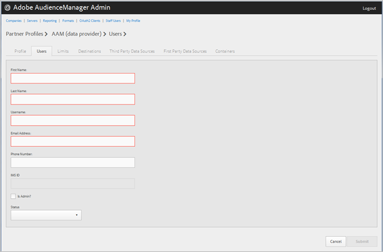

# Administrar usuarios de la compañía {#manage-company-users}

Cree nuevos usuarios de Audience Manager o edite y elimine los existentes.

<!-- t_manage_company_users.xml -->

1. Clic **[!UICONTROL Companies]**, luego busque y haga clic en la empresa deseada para mostrar su [!UICONTROL Profile] página.

   Utilice el [!UICONTROL Search] o los controles de paginación en la parte inferior de la lista para encontrar la empresa deseada. Puede ordenar cada columna en orden ascendente o descendente haciendo clic en el encabezado de la columna deseada.
1. Haga clic en **[!UICONTROL Users]** pestaña.
1. Para crear un nuevo usuario, haga clic en **[!UICONTROL Create a New User]**. Para editar un usuario existente, busque y haga clic en el usuario que desee en **[!UICONTROL Username]** columna.

   

1. Rellene los campos:

   * **[!UICONTROL First Name]**: (Obligatorio) Especifique el nombre del usuario.
   * **[!UICONTROL Last Name]**: (Obligatorio) Especifique el apellido del usuario.
   * **[!UICONTROL Username]**: (Obligatorio) Especifique el nombre de usuario del Audience Manager. Los nombres de usuario deben ser únicos.
   * **[!UICONTROL Email Address]**: (obligatorio) especifique la dirección de correo electrónico del usuario.
   * **[!UICONTROL Phone Number]**: especifique el número de teléfono del usuario.
   * **[!UICONTROL IMS ID]**: del usuario [!UICONTROL Identity Management System ID]. Este ID permite al usuario vincular soluciones de Adobe a Adobe Experience Cloud.
   * **[!UICONTROL Is Admin]**: convierta a este usuario en un usuario Audience Manager. Un administrador tiene todas las funciones de usuario de Audience Manager para este socio.
   * **[!UICONTROL Status]**: Al crear un nuevo usuario, este campo se muestra inicialmente como **[!UICONTROL Pending]** hasta que el usuario inicie sesión y restablezca la contraseña temporal. Si está editando un usuario existente, puede seleccionar entre los siguientes estados:
      * **[!UICONTROL Active]**: Especifica que este usuario es un usuario Audience Manager activo.
      * **[!UICONTROL Deactivated]**: Especifica que este usuario es un usuario Audience Manager desactivado.
      * **[!UICONTROL Expired]**: Especifica que este usuario es un usuario caducado.
      * **[!UICONTROL Locked Out]**: especifica que este usuario es un usuario bloqueado.

1. Haga clic **[!UICONTROL Submit]**.

## Eliminar un usuario {#delete-user}

Para eliminar un usuario:

1. Clic **[!UICONTROL Companies]**, busque y haga clic en la empresa que quiera y luego haga clic en **[!UICONTROL Users]** pestaña.
1. Clic   en el **[!UICONTROL Actions]** del usuario deseado.
1. Clic **[!UICONTROL OK]** para confirmar la eliminación.
