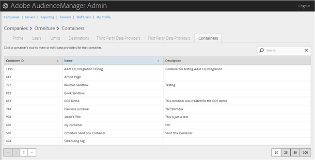
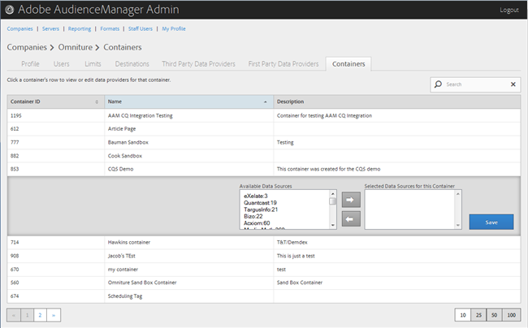

# Administrar contenedores {#manage-containers}

Vista o edición de proveedores de datos para contenedores.

<!-- t_containers.xml -->

>[!NOTE]
>
>De forma predeterminada, las compañías se crean con un contenedor. Puede crear más contenedores para una compañía en la interfaz de usuario, en **[!UICONTROL Tools > Tags]**.

1. Haga clic en **[!UICONTROL Companies]**, luego localice y haga clic en la compañía deseada para mostrar su [!UICONTROL Profile] página.

   Use el cuadro [!UICONTROL Search] o los controles de paginación en la parte inferior de la lista para encontrar la compañía deseada. Puede ordenar cada columna en orden ascendente o descendente haciendo clic en el encabezado de la columna deseada.

1. Haga clic en la ficha **[!UICONTROL Containers]**.

   

1. Haga clic en la fila de un contenedor para realizar la vista o editar los proveedores de datos de ese contenedor.

   

1. Mueva los orígenes de datos de las listas **[!UICONTROL Available Data Sources]** y **[!UICONTROL Selected Data Sources for This Container]** seleccionando los orígenes de datos deseados y haciendo clic en las flechas derecha o izquierda según sea necesario.

   También puede realizar esta tarea desde la página [Proveedores de datos de terceros](../companies/admin-third-party-providers.md#task_E942DD674D794BA6B8EFD52FD866E689).

1. Haga clic en **[!UICONTROL Save]** si ha realizado cambios.

>[!MORELIKETHIS]
>
>* [Sincronización de ID con Media Optimizer](../companies/admin-amo-sync.md#concept_2B5537233DAA4860B3503B344F937D83)

