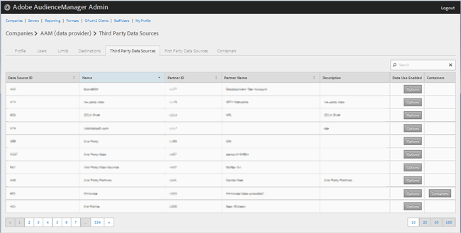
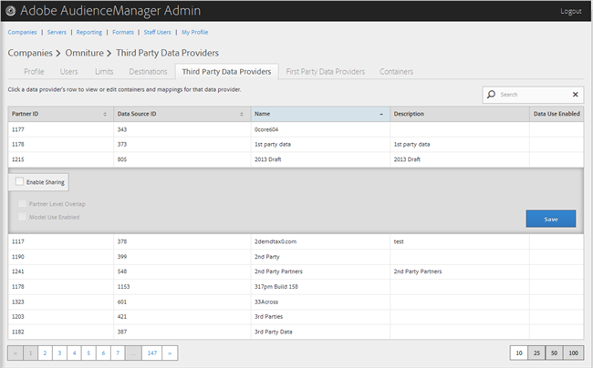

# Administrar proveedores de datos de terceros {#manage-third-party-data-providers}

Vista o edición de contenedores y asignaciones para proveedores de datos de terceros. También puede habilitar el uso compartido con diferentes proveedores de datos.

1. Haga clic en **[!UICONTROL Companies]**, luego localice y haga clic en la compañía deseada para mostrar su [!UICONTROL Profile] página.

   Use el cuadro [!UICONTROL Search] o los controles de paginación en la parte inferior de la lista para encontrar la compañía deseada. Puede ordenar cada columna en orden ascendente o descendente haciendo clic en el encabezado de la columna deseada.
1. Haga clic en la ficha **[!UICONTROL Third Party Data Providers]**.

   

1. Haga clic en la fila de un proveedor de datos para realizar la vista o editar contenedores y asignaciones para ese proveedor de datos.

   

1. Seleccione **[!UICONTROL Enable Sharing]** para habilitar las siguientes opciones:

   * **Superposición de nivel de socio:**
   * **Uso del modelo activado:** permite que esta compañía utilice este proveedor de datos al crear modelos algorítmicos.

   Cuando habilita el uso compartido, obtiene acceso a las características de este proveedor de datos.

1. (Condicional) Si el contenedor está habilitado para este proveedor, puede seleccionar contenedores para este proveedor de datos moviendo los contenedores deseados de la lista disponible a la lista seleccionada.

   También puede realizar esta tarea desde la página [Contenedores](../companies/admin-manage-containers.md#task_61DB5CEECC5049DD8D059C642AC3F967).
1. Haga clic en **[!UICONTROL Save]** si ha realizado cambios.