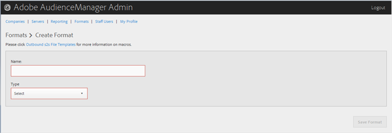

# Crear o editar un formato {#create-or-edit-a-format}

Utilice la página de la herramienta de administración de Audience Manager para crear un nuevo formato o editar un formato existente. [!UICONTROL Formats]

<!-- t_create_format.xml -->

>[!TIP]
>
>Al seleccionar un formato para los datos salientes, lo mejor es, si es posible, reutilizar un formato existente. El uso de un formato ya probado garantiza que los datos salientes se generarán correctamente. Para ver exactamente cómo se formatea un formato existente, haga clic en la [!UICONTROL Formats] opción de la barra de menús y busque el formato por nombre o por número de ID. Los formatos o macros con formato incorrecto utilizados en los formatos proporcionan una salida con formato incorrecto o evitan que la información se muestre por completo.

1. Para crear un nuevo formato, haga clic en **[!UICONTROL Formats]** > **[!UICONTROL Add Format]**. Para editar un formato existente, haga clic en el formato deseado en la **[!UICONTROL Name]** columna.

   

1. Rellene los campos:
   * **Nombre:** (Requerido) Proporcione un nombre descriptivo para el formato.
   * **Tipo:** (Requerido) Seleccione el formato deseado:
      * **[!UICONTROL File]**:: Envía datos mediante [!DNL FTP] archivos.
      * **[!UICONTROL HTTP]**:: Incluye los datos en un [!DNL JSON] contenedor.

1. (Condicional) Si elige **[!UICONTROL File]**, rellene los campos:

   >[!NOTE]
   >
   >Para obtener una lista de las macros disponibles, consulte Macros [de formato](../formats/file-formats.md#concept_A867101505074418A58DE325949E5089) de archivo y Macros [de formato](../formats/web-formats.md#reference_C392124A5F3F42E49F8AADDBA601ADFE)HTTP.

   * **[!UICONTROL File Name]::**Especifique el nombre de archivo del archivo de transferencia de datos.
   * **Encabezado:** Especifique el texto que aparece en la primera fila del archivo de transferencia de datos.
   * **[!UICONTROL Data Row]::**Especifique el texto que aparece en cada fila de salida del archivo.
   * **[!UICONTROL Maximum File Size (In MB)]::**Especifique el tamaño máximo de archivo para los archivos de transferencia de datos. Los archivos comprimidos deben ser menores que 100 MB. No hay límite en el tamaño del archivo sin comprimir.
   * **[!UICONTROL Compression]::**Seleccione el tipo de compresión deseado: gz o zip para sus archivos de datos. Para que envío[!UICONTROL AWS S3], debe utilizar archivos .gz o sin comprimir.
   * **[!UICONTROL .info Receipt]::**Especifica que se genera un archivo de control de transferencia ([!DNL .info]). El[!DNL .info]archivo proporciona información de metadatos sobre las transferencias de archivos para que los socios puedan comprobar que el Audience Manager ha gestionado correctamente las transferencias de archivos. Para obtener más información, consulte[Transferencias-Archivos de Control para Transferencias](https://marketing.adobe.com/resources/help/en_US/aam/c_s2s_add_transfer_control_files.html)de Archivos de Registro.
   * **[!UICONTROL MD5 Checksum Receipt]::**Especifica que se genera un cobro de[!DNL MD5]suma de comprobación. Recibo[!DNL MD5]de suma de comprobación para que los socios puedan comprobar que el Audience Manager gestionó correctamente la transferencia completa.

1. (Condicional) Si elige **[!UICONTROL HTTP]**, rellene los campos:

   * **[!UICONTROL Method]::**Elija el[!DNL API]método que desee utilizar para el proceso de transferencia:
      * **[!UICONTROL POST]::**Si selecciona[!DNL POST], seleccione el tipo de contenido ([!DNL XML]o[!DNL JSON]) y, a continuación, especifique el cuerpo de la solicitud.
      * **[!UICONTROL GET]::**Si selecciona[!DNL GET], especifique los parámetros de consulta.

1. Haga clic **[!UICONTROL Create]** si está creando un nuevo formato o haga clic **[!UICONTROL Save Updates]** si está editando un formato existente.

## Eliminar un formato {#delete-format}

1. Haga clic **[!UICONTROL Formats]**.
2. Haga clic  en la **[!UICONTROL Actions]** columna del formato deseado.
3. Click **[!UICONTROL OK]** to confirm the deletion.
