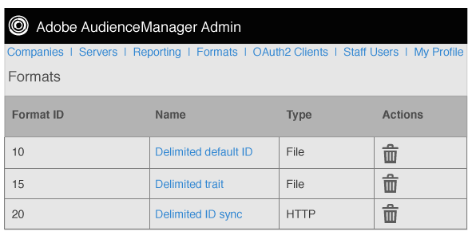

# Información general de formatos {#formats-overview}

Un formato es una plantilla guardada (o archivo) que utiliza macros para organizar el contenido de los datos enviados a un destino. Los tipos de formato incluyen [!DNL HTTP] formatos y formatos de archivo. [!DNL HTTP] envía datos en un [!DNL JSON] objeto con un [!DNL POST] método o [!DNL GET] . Los formatos de archivo envían datos en un archivo por [!DNL FTP]. Las macros utilizadas por cada formato permiten definir nombres de archivo, definir encabezados de archivo y organizar el contenido de un archivo de datos. En Admin [!DNL UI], puede crear, guardar y reutilizar formatos al configurar destinos para clientes.

